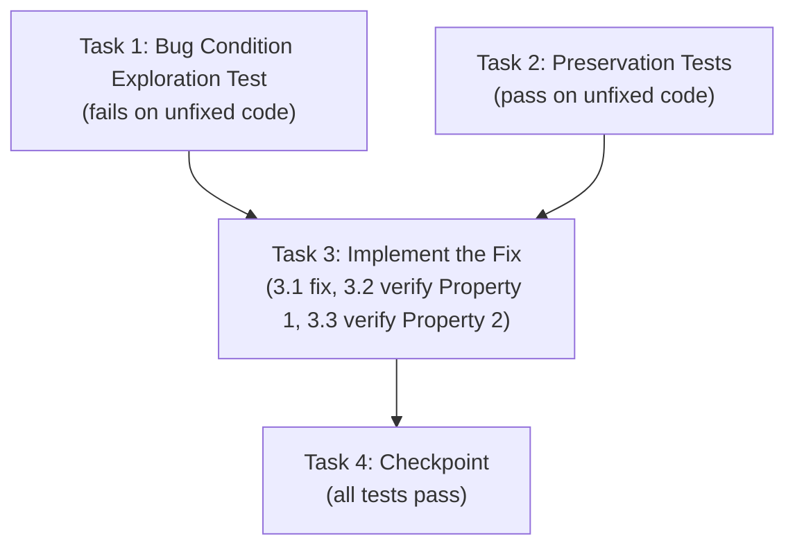

# Implementation Plan

## Overview

This plan fixes the inverted versus winner derivation in `Game._gameOver()` using the exploratory bugfix workflow. It follows a test-first ordering: write a bug condition exploration test that fails on the unfixed code (proving the bug), write preservation tests that pass on the unfixed code (capturing behavior to protect), then apply the fix and confirm both properties hold.

- **Property 1: Bug Condition / Expected Behavior** — the survivor must be declared the winner, with the correct win counter incremented and a deterministic tie rule.
- **Property 2: Preservation** — solo-mode display, match-done detection, match-result text, and overlay fields must remain unchanged.

## Tasks

- [ ] 1. Write bug condition exploration test
  - **Property 1: Bug Condition** - Survivor Is Declared Winner
  - **IMPORTANT**: Write this property-based test BEFORE implementing the fix
  - **CRITICAL**: This test MUST FAIL on unfixed code - failure confirms the bug exists
  - **DO NOT attempt to fix the test or the code when it fails**
  - **NOTE**: This test encodes the expected behavior - it will validate the fix when it passes after implementation
  - **GOAL**: Surface counterexamples that demonstrate the bug exists
  - Set up a minimal `Game`-like context so `_gameOver()` can run: stub `this.players` with `alive` flags, `this.mode = 'versus'`, `this.p1Wins`/`this.p2Wins`, and the DOM elements it reads/writes (`goTitle`, `goWinner`, win display), then invoke `_gameOver()` and assert on the winner-dependent outputs
  - **Bug Condition** (from design `isBugCondition`): `X.mode = 'versus' AND ((NOT X.p0Alive) OR (NOT X.p1Alive))` — versus mode with at least one player topped out
  - **Scoped PBT Approach**: For this deterministic bug, generate `{p0Alive, p1Alive}` versus states with at least one dead player and assert the survivor is the winner:
    - For all price/state values where only P1 survives (`p0Alive = true, p1Alive = false`) → assert `winner = 0`, `p1Wins` increments, title/label reflect "PLAYER 1 WINS!"
    - For all states where only P2 survives (`p0Alive = false, p1Alive = true`) → assert `winner = 1`, `p2Wins` increments, "PLAYER 2 WINS!"
    - For the tie case (`p0Alive = false, p1Alive = false`) → assert `winner` is a defined value (deterministic tie rule → player 1, index 0)
  - The test assertions match the Expected Behavior (design Property 1): survivor is winner, correct counter increments, deterministic tie
  - Run test on UNFIXED code
  - **EXPECTED OUTCOME**: Test FAILS (this is correct - it proves the inverted derivation at `_gameOver()` line ~520)
  - Document counterexamples found (e.g., "player 1 topped out, player 2 survived: system declares player 1 winner and increments p1Wins instead of p2Wins")
  - Mark task complete when test is written, run, and failure is documented
  - _Requirements: 1.1, 1.2, 1.3, 1.4, 2.1, 2.2, 2.3, 2.4_

- [ ] 2. Write preservation property tests (BEFORE implementing fix)
  - **Property 2: Preservation** - Non-Buggy Paths Unchanged
  - **IMPORTANT**: Follow observation-first methodology
  - **Non-bug condition** (where `isBugCondition` returns false): solo mode, or any state that does not exercise the versus winner derivation
  - Observe behavior on UNFIXED code and record actual outputs:
    - Solo mode game over shows "GAME OVER" with the player's score, level, and lines and does NOT touch `p1Wins`/`p2Wins`
    - A versus player reaching `ceil(BEST_OF / 2) = 3` wins marks the match done and displays the correct match-winning player
    - Below 3 wins, the match-result text stays empty and the series continues
    - The overlay renders score/level/lines fields and the running match score `p1Wins - p2Wins`
  - Write property-based tests capturing these observed patterns (from Preservation Requirements in design):
    - Generate random solo-mode game-over states → assert "GAME OVER" display and win counters untouched
    - Generate random pre-existing `p1Wins`/`p2Wins` values → assert match-done detection and match-result text behave as observed
    - Assert overlay fields (score/level/lines, `p1Wins - p2Wins`) render as observed
  - Property-based testing generates many cases across the input domain for stronger preservation guarantees
  - Run tests on UNFIXED code
  - **EXPECTED OUTCOME**: Tests PASS (this confirms the baseline behavior to preserve)
  - Mark task complete when tests are written, run, and passing on unfixed code
  - _Requirements: 3.1, 3.2, 3.3, 3.4_

- [ ] 3. Fix for inverted versus winner derivation in `_gameOver()`

  - [ ] 3.1 Implement the fix
    - In `Game._gameOver()` in `app.js` (~line 520), replace the inverted loser derivation with a survivor-based winner derivation
    - Remove: `const loser = this.players[0].alive ? 0 : 1; const winner = 1 - loser;`
    - Add: `const winner = this.players[0].alive ? 0 : (this.players[1].alive ? 1 : 0);`
    - This yields: only P1 alive → `0`; only P2 alive → `1`; both dead → `0` (deterministic tie rule, tie goes to player 1)
    - Leave downstream logic untouched: `winner` continues to feed the `p1Wins`/`p2Wins` increment, `_updateWinDisplay()`, `matchDone` computation, `goTitle`/`goWinner`/color-class assignment, and match-result text
    - Leave the `if (this.mode === 'solo')` branch untouched
    - _Bug_Condition: isBugCondition(X) = X.mode = 'versus' AND ((NOT X.p0Alive) OR (NOT X.p1Alive)) from design_
    - _Expected_Behavior: survivor is winner — only P1 survives → winner=0; only P2 survives → winner=1; both dead → winner=0 (deterministic tie) from design Property 1_
    - _Preservation: Preservation Requirements from design (solo display, match-done detection, match-result text, overlay fields)_
    - _Requirements: 2.1, 2.2, 2.3, 2.4_

  - [ ] 3.2 Verify bug condition exploration test now passes
    - **Property 1: Expected Behavior** - Survivor Is Declared Winner
    - **IMPORTANT**: Re-run the SAME test from task 1 - do NOT write a new test
    - The test from task 1 encodes the expected behavior; when it passes it confirms the survivor is correctly declared the winner with the right counter increment and deterministic tie
    - Run bug condition exploration test from step 1
    - **EXPECTED OUTCOME**: Test PASSES (confirms bug is fixed)
    - _Requirements: 2.1, 2.2, 2.3, 2.4_

  - [ ] 3.3 Verify preservation tests still pass
    - **Property 2: Preservation** - Non-Buggy Paths Unchanged
    - **IMPORTANT**: Re-run the SAME tests from task 2 - do NOT write new tests
    - Run preservation property tests from step 2
    - **EXPECTED OUTCOME**: Tests PASS (confirms no regressions in solo mode, match-done detection, match-result text, or overlay fields)
    - Confirm all tests still pass after fix (no regressions)
    - _Requirements: 3.1, 3.2, 3.3, 3.4_

- [ ] 4. Checkpoint - Ensure all tests pass
  - Ensure the bug condition exploration test (Property 1) and preservation tests (Property 2) all pass after the fix
  - Confirm the survivor is declared the winner in each single-survivor case, the correct win counter increments, and the tie resolves deterministically
  - Confirm solo-mode and match-scoring behavior is unchanged
  - Ask the user if questions arise

## Task Dependency Graph

Task 1 (bug condition exploration test) and Task 2 (preservation tests) are standalone and can be written in parallel — both run against the unfixed code. Task 3 (the fix) depends on both, since the fix is applied only after the bug is understood (Task 1) and the baseline is captured (Task 2). Task 4 (checkpoint) depends on Task 3.



- **Task 1** and **Task 2**: standalone / parallel (no dependencies)
- **Task 3**: depends on Task 1 and Task 2
- **Task 4**: depends on Task 3

```json
{
  "waves": [
    {
      "wave": 1,
      "tasks": ["1", "2"],
      "dependsOn": []
    },
    {
      "wave": 2,
      "tasks": ["3"],
      "dependsOn": ["1", "2"]
    },
    {
      "wave": 3,
      "tasks": ["4"],
      "dependsOn": ["3"]
    }
  ]
}
```

## Notes

- **Test-first ordering is intentional.** Task 1 must FAIL on the unfixed code (this confirms the bug exists) and Task 2 must PASS on the unfixed code (this captures the baseline behavior to preserve). Do not implement the fix before both are written and their expected outcomes observed.
- **Do not fix the failing test in Task 1.** Its failure is the evidence that the bug is real; the same test validates the fix once it passes in Task 3.2.
- **Reuse the same tests.** Tasks 3.2 and 3.3 re-run the tests from Tasks 1 and 2 — do not author new tests for verification.
- **Scope of the change.** The fix is limited to the survivor-based winner derivation in `Game._gameOver()` (~line 520 in `app.js`). Downstream logic (win-counter increment, `_updateWinDisplay()`, `matchDone`, overlay rendering) and the solo-mode branch must remain untouched.
- **Deterministic tie rule.** When both players are topped out, the winner resolves to player 1 (index 0) so the outcome is reproducible in tests.
